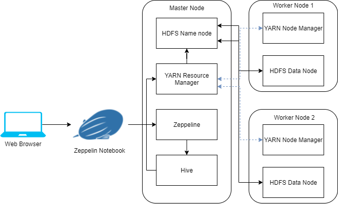
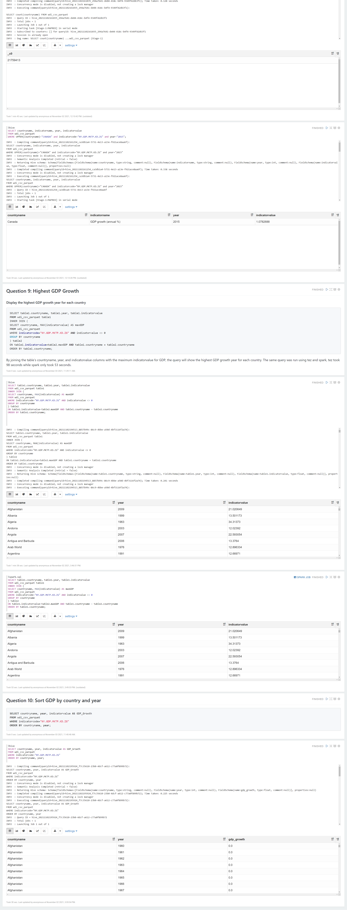

Table of contents
* [Introduction](#Introduction)
* [Hadoop Cluster](#Introduction)
* [Hive Project](#Introduction)
* [Improvements](#Introduction)

# Introduction
The purpose of this project is to provide a method for analyzing large
volumes of financial trade data. Due to the large size of the dataset, I
provisioned a Hadoop cluster using GCP DataProc to allow for distributed
processing of the data. The cluster consists of 1 master node and 2 worker
nodes, and operates using Big Data tools such as YARN, Hive, and MapReduce.

The financial data was exported from Google BigQuery to Google Storage, and
from there was copied to the cluster's distributed file system. Queries were
written using HiveQL to easily execute MapReduce jobs, and the data was optimized
by partitioning and storing as a Parquet file.

# Hadoop Cluster
### Cluster Architecture

### Cluster Hardware
- Master Node x 1: 2 CPU cores, 12GB RAM, 100GB Storage
- Worker Node x 2: 2 CPU cores, 12GB RAM, 100GB Storage

### Big Data Tools
#### HDFS
HDFS is the distributed file system used by Hadoop to store large files. The
files are broken up into 128MB blocks, and stored across the cluster in data 
nodes. Blocks are replicated into three copies for redundancy purposes, so if
one data node fails the cluster can still access all of the data. The name node
stores the metadata for all files in the cluster, including information regarding
file type, size, permissions, location in the cluster, and location of replicate
blocks.
#### YARN
YARN is the resource manager and job scheduler that handles all of the resource
allocation for MapReduce jobs in Hadoop. The architecture consists of a resource
manager and application masters. The resource manager sits on the master node, and
communicates with node managers on the worker nodes. It monitors resource consumption
and demand, and schedules allocation of these resources for different jobs. The
application masters are located on the worker nodes, and they launch containers
to run jobs scheduled by the resource manager.
#### MapReduce
MapReduce is a programming framework that allows for writing algorithms for
distributed data processing. It consists of three main parts: map, shuffle, and
reduce. Mappers read file blocks and output key value pairs, where the key is the
byte offset and the value is the line content. They then parse the line content
and produce a new key value pair with the desired values. The key value pairs
are shuffled, and all records with the same key are sent to the same reducer.
Reducers match the values by key, sort them, and combine the results.
#### Hive
Hive was developed by facebook to make writing MapReduce jobs much more simple.
It allows programmers to write SQL like queries using Hive Query Language, and
then translates this to a MapReduce job. Metadata regarding table schema, locations, 
and partitions are stored in the Hive Metastore.

#### Zeppelin
Zeppelin is a web interface for performing hive queries on data stored in an
HDFS. It allows programmers to write code in a notebook format, editing and
running individual blocks of code and displaying their output.

# Hive Project
The data analyzed for this project was contained in a file larger than 2GB,
and even using a Hadoop cluster queries ran very slowly on the initial dataset.
To improve the processing speed, I made various optimizations:
### Parquet File Format
Converting the CSV file into a columnar parquet file greatly increased the 
query speed. Parquet files divide the table into columns, allowing the 
algorithm to skip over unnecessary information and process the data much faster.
It also optimized file compression, reducing file size and further improving
query speed.
### Data Partitions
I partitioned the table by year, which creates a subdirectory under the main
file directory for each year. This narrows down the search area for queries
when looking for records from a certain year, as they now don't have to search
over all records from every year.
- Discuss how you optimized Hive queries? (e.g. partitions, columnar, etc..)

### Zeppelin Notebook

# Improvements
- Partitioning the parquet files would have greatly reduced query time
- Indexing the tables would improve the search time from O(N) to O(log(n))
- Hardware improvements (more worker nodes)